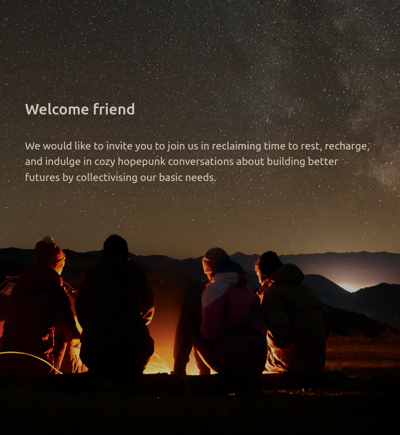
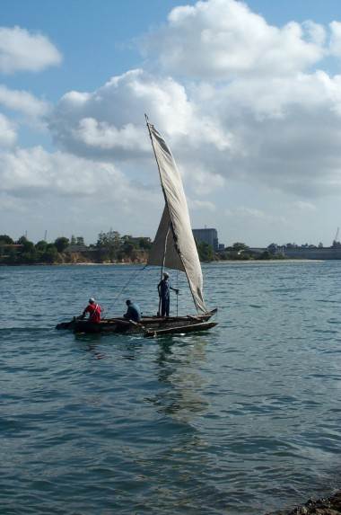
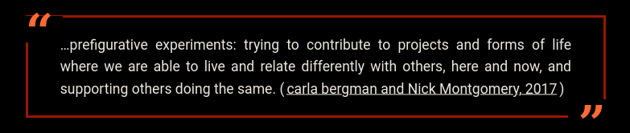

<!-- 
* Intro
  * Acknowledgement of country
  * Introduction round
  * Logistics
  * Supporting your participation

## Acknowledgement of country Example Speaking Notes
## Introdution Example Speaking Notes
Thank you all for being here today - hopefully you've picked up a bit of the context for why we're here today from Yam Daisy. 

So I'd like to beign with a circle around the room so everyone has a chance to introduce themselves and settle into the space a bit.

There will be more oppourtinties to talk with each other later, for now please just share:  
- names / pronouns / and what land you're arriving from.
- And, complete the sentence "One characteristic of my vision of a better future is...."
[ACTIVITY]
Thank you all for sharing. Now I'd like to run through what you can expect for our time together today. 

## Logistics Example Speaking Notes 

## Supporting your participation Example Speaking Notes

-->

---
## *Panga* 

> Supporting experimental approaches to collectively meeting our basic needs of food, shelter, care, safety, energy, and transport"

<!-- 
Panga Example Speaking Notes

So, this thing we're calling Panga emerged within the context of Jade and/or I having had conversations with many of you, as well as others in our various networks around various approaches to collaborative housing, food cooperatives, and collective approaches to care. 

At some point in 2023 we decided to collaborate on finding ways to connect these conversations and support the various initatives as they emerge. 

We'll go into more details later, but for now it is enough to know that the goal we've decided to focus on is "supporting experimental approaches to collectively meeting our basic needs of food, shelter, care, saftey, energy, and transport".

Before we get to the details of *how* and *why* we aim to support these experiments, it is important to draw attention to the specific values and dense concepts this goal draws upon. 

-->

---
##  Workshop Aims 

* Building connections around our interest in collective approaches to meeting our basic needs   

* Sharing the concepts we are building upon within *Panga*   
  
* Inviting ongoing conversations and collaborations that build on shared conceptual contexts  

<!-- 
Workshop Aims Example Speaking Notes

So our reasons for preparing this workshop were to invite ongoing conversations and collaborations that can build upon a shared context    

We aim to provide this shared context by sharing some of the key concepts that we hope to build upon with Panga 

We also hope that this workshop opens up more oppourtunities for you each to connect with others who are intersted in experimenting with collectivising one or more of their basic needs.

In terms of structure, we'll begin by contextualising the change-making stratergies we're focusing on. We'll then talk about Panga in detail - both in as a project with specific values and theories of change, and as a practice we invite others to participate in.  

Then, after we've finished the presentation and main activities, we'll open up space for further less-structured discussions. 

-->

---
# Overview (hide slide)
### Stratergy 
### Project
### Practice
### Participation

---
# (to be presented over multiple slides)
## Strategy 
  1. In **changing** times
  2. In changing times we **prefigure** better futures
  3. In changing times we prefigure better futures by **collectivising**
  4. In changing times we prefigure better futures by collectivising to meet **basic needs**
  5. In changing times we prefigure better futures by collectivising to meet basic needs, **grounded in place**

---
# (to be presented over multiple slides)
## Project
  * Invoking Panga
  * Values & Theories of Change

---
## Invoking Panga

> In changing times 
**how can we support experiments** that prefigure better futures by collectivising to meet basic needs grounded in place 

<!-- 
Speaking notes....

-->

---
## Values
Grounded  
Interdependent 
Prefigurative
Pluralistic

## Theories of Change
Resilience through collectivism
Think globally, act locally
Prefiguring better futures 

<!-- 
Speaking notes....

The values we hope to embody through Panga's approach to cultivating more collective practices are: 
 
  * Grounded
  * Interdependent
  * Prefiguritive 
  * Pluralistic

The best way to describe these values is to highlight how they reflect our theories of change, so I'll go through each of these in more detail. 

For this, it may help to know that a theory of change statement typically has the structure 
'If we do this TACTIC then we can achive this STRATEGIC GOAL because of these REASONS (or, by this MECHANISM)'

In Panga, we are focusing on the tactic of 'experimenting with supporting multiple approaches to collectively meeting basic needs within our local areas'. 

We think that this tactic contributes towards three goals: 
* Resiliance through collectivism
* Thinking globally while acting locally 
* Prefiguring better futures

-->

---

# If we experiment with collectively meeting the basic needs within our local areas, we can...

build local resilience by cultivating opportunities to practice relational skills that will help us collectively govern common resources when needed

##  Resilience through collectivism

# Reflecting the values we place in... 
remaining **grounded** in our local contexts while rparticipating in **prefigurative** practices that contribute to better futures by cultivating **interdependent** relationships

<!-- 
Speaking notes....

In the coming years and decades, local resilience will have real, on-the-ground benefits to people’s lives as we deal with the increasing effects of climate change.

We believe that experimenting with multiple pluralistic collectives to manage basic resources can contribute to greater local resilience by providing oppourtinities to practice the relational skills that will help  us collectively govern common resources when climate-change disrupts the current supplies of basic needs (such as food, energy, and shelter) via private and/or public systems.

Our interest in this theory of change reflects the value we place on remaining **grounded** in our local contexts, while participating in **prefigurative** practices that contribute to better futures by * cultivating resilience skills such as the web of **interdependent** trust-based relationships that have been repeatedly shown to underpin the sustainability of collective practices 

-->

---

# If we experiment with collectively meeting the basic needs within our local areas, we can...

change the Overton Window by modelling alternatives to the status quo and amplifying, and being amplified by, collective practices across the globe 

##  Think globally, act locally

# Reflecting the value we place in... 
 remaining **grounded** by our ability to impact our local conditions, while cultivating a **pluralistic** appreciation for alternative stratergies emerging within different conditions 

<!-- 
Speaking notes....

With Panga we are concentrating on our local areas. The idea is that supporting an increase in the number of experimental ways of living more collectively in a particular area will have a noticeable impact on the Overton Window by modelling alternatives to the status quo and amplifying, and being amplified by, collective practices across the globe 

These beliefs reflects our appreciation that the local and global are **interdependent** and our value for remaining **grounded** by our ability to impact our local conditions,  while cultivating a **pluralistic** appreciation for alternative strategies emerging within different conditions 

-->

---

# If we experiment with collectively meeting the basic needs within our local areas, we can...

explore multiple here-and-now implementions of our desired potential futures by supporting each other to explore diver approaches to collectively governing common resources

## Prefiguring better futures
# Reflecting the value we place in... 
**pluralistic** visions of what potential better futures could be, and the role of **prefigurative** experiments in our broader efforts to collectively reach towards ever better yet-to-be-determined futures. 

# [Prefigurative Politics in Practice](https://commonslibrary.org/prefigurative-politics-in-practice/)

<!-- 
Speaking notes....

 In Panga we focus on experiments in various forms of *collective practices* we hope will help to 'prefigure' better futures.

As a theory of change, the idea is that if we experiment with collectively meeting the basic needs within our local areas, we can  explore multiple here-and-now implementations of our desired potential futures by supporting each other to explore multiple approaches to collective governance of shared resources

This idea draws on the concept of 'Prefigurative Politics' for actions that contribute to political change through ‘the deliberate experimental implementation of desired future social relations and practices in the here-and-now’. 

While the term 'prefigurative politics' emerged from a particular sets of activist and academic contexts, I wrote an article for the Commons Library outlining how this concept has long been an important features of grassroots organising.

This theory of change reflects our value in cultivating **pluralistic** visions of what potential better futures could be, and the value we place on the potential for **prefigurative** practices to contribute, along with other forms of activism, to us collectively reaching towards ever better yet-to-be-determined futures.

For today, the important point is that prefigurative politics play an important role in change-making practices that can support other forms of activism - including efforts that focus on resisting and/or reforming existing systems - by planting the seeds of multiple alternatives we may want to build on in the future.
-->

---
# (to be presented over multiple slides)
## Practice 
  * Overlapping pluralist collectivism
  * (activity)

  
---
## Overlapping Pluralist Collectivism
to do

---
## Brainstorming Activity
# Describe examples of how small groups might experiment with...

* Reducing reliance on profit-driven providers of food and energy

* Reducing reliance on centralised saftey services 

* Moving towards collective care responsibilities

* Moving towards collective stewardship of housing as shelter while returning land-governance to Indigenous custodians

<!-- 
Facilitation notes....

ACTIVITY: Organise participants into four groups, and ask them to brainstom potential experiments for assigned goals (e.g., for each group assign one 'reduce' goal and one 'move towards' goal to provide examples experiments for): 

* Moving away from profit-driven providers of food and energy and towards collectively governed production and distribution 

* Moving away from relying on centralised saftey services  and towards collectively preparing strateries for surviving external emergancies and internal conflicts together 

* Moving away from individualised expectations of self-care and towards collective care responsibilities

* Moving away from accuring equity in property towards collective stewardship of housing as shelter and returning land to Indigenous governance 
-->

---
# (HIDE SLIDE - see multiple slides for this section below)
## Participating
  * Participation not membership
  * Avenues for participation
    * Experiments in supporting collectivism
    * Using Panga resources in your own collective projects and providing feedback
    * Campfire
  * Further resources

---
## Participation not membership

<!--
Panga is intended to be an idea maintained by a porously bounded group of participants, rather than a network or organisation you can join and claim 'membership' rights.

In invoking the idea of Panga we are seeking collaborators who are willing to join us in taking responsibility for creating and maintaining the respectful, interdependent relationships from which sustainable collective practices can emerge.

We want Panga to function as a focal point we can gather around to share hihg-context resoruces for exploring different approaches to collectivising basic needs, while still remaining open to new participants. 

To achieve this we envision Panga as a project with multiple avenues for participation that cultivate a focal point we can gather around to share high-context resoruces for exploring different approaches to collectivising basic needs. Rather than being a bounded group, we hope that the idea of Panga can 'grow at the rate of trust' with new participants being invited in as we have capacity to support them to participate in sustainable ways.

An important aspect of this porously bounded group of Panga participants is the multiple avenues of participation we hope to cultivate. 
-->

---
## Avenues for participation

# Decision-making Participation 
Contributing to stewarding future iterations of Panga

# Vision-enacting Participation
Using & adapting Panga tools when experimenting with collectivising basic needs

# Vision-nourishing Participation 
Recharging at a cosy hopeunk 'Campfire' <!-- see next slide-->

<!-- 
To explain the current avenues for participating in the Panga I'll focus on examples related to our goal of curating, developing, and maintaining a set of technical and conceptual tools that reduce the barriers to forming multiple overlapping experiments in collective practices.

In relation to this goal, participation could involve the high-capacity involvement of contributing to the decision-making process of stewarding future iterations of Panga, such as helping to decide which tools to prioritise. 

* We also want to encourage participation that helps to enact the vision of there being multiple experiments in collectivising basic needs in our local areas. For example, we invite people experimenting with collective practices to use and adapt the resources that we curate, develop, and maintatian as part of the Panga project - without needing to participate in the development or maintance of Panga resources. In doing so, these participants may also choose to contribute to improving and expanding this set of resources.

* At the same time, we often find that the dire state of the status quo world is so overwhelming that it can reduce our capacity to engage with anything beyond surviving from day to day. We know many others feel similarly, and so also want to allow space to nurture even the most minimal form of participation, such as via intermittent engagement in 'campfire' conversations.   

-->

---

## 

<!-- 
Speaking notes....

* The Panga 'Campfire' is intended as a virtual space to gather and recharge with cozy hopepunk conversations. 
* We're using 'conversations' loosly here. While some may choose to engage in conversations and connect with potential collaborates for upcomming local experiements in collectivisng basic needs, the intention is to provide a space to read and share examples of how people are experimenting in collectivising basic needs.  

-->

---
---
## Invitation principles

<!-- 
Speaking notes....

While we are fortunate to participate in multiple broader networks through which we connected with most of you, we recognise the privilages that allow us to have the capacity to participate in multiple networks.

Panga is intended to complement the continued flourishing of such networks, by focusing on supporting small self-governing groups to participate in multiple *place-based* experiments in collectively meeting our *basic needs*. 

For those intereted, we are therefore hoping to co-create additional opportinties to connect with each other about our various approaches to experimenting with collectivising one or more of their basic needs (without joiniing yet-another-network).

As collectivist experiments have highlighted there is value of cultivating informal networks large enough to support multiple self-governing groups yet small enough that everyone is connected to everyone else, either directly or via someone they trust

With this in mind, once someone is involved in Panga they can support new people to participate with them by following a transparent invitation process and taking reponsibility for supporting the new person navigate the space.

-->

---
## Further Resources

* More info about [Panga](https://panga.network/orientation) and the [Panga Campfire](https://panga.network/campfire/)

* Exercise to help identify one or more [Theory of Change](https://commonslibrary.org/wheres-the-power-developing-your-theory-of-change-template/) relevant to a particular set of contexts and aims.

* [Commoning](https://commonslibrary.org/practising-commoning/) concept summary 

* [Prefigurative Politics](https://commonslibrary.org/prefigurative-politics-in-practice/) concept summary

<!-- 
Speaking notes....
-->

---
<!-- 
Unsorted notes: 

Pluralism: We aim to support experiments in a wide range of different approaches to collectiving basic needs.  We don't expect that there is any single 'right' way to collectively governing resources that will be appropriate for all local contexts.  

The Panga 'Campfire' is intended as a virtual space to gather and recharge with cozy hopepunk conversations. We're using 'conversations' loosly here. While some may choose to engage in conversations and connect with potential collaborates for upcomming local experiements in collectivisng basic needs, the intention is to provide a space to read and share examples of how people are experimenting in collectivising basic needs.  

We also want to invite others to adapt the emerging Panga tools and processes to experiment with collectivising specific sets of basic needs, and/or participate in co-creating the next iteration of Panga with us.

Inevitably, there will also be some values and concepts we're treating as either as background context and/or potential tangents  

So if we use any unfamilar terms let us know. We'll do our best to clarify background concepts on the fly and suggest some resources that provide more detail on the potential tangents.  

For example, while the 'Overton Window' and 'Commons' are a background concepts we might reference in passing and can clarify if needed, explaining our choice of the term 'Panga' for this project could lead to tangents... 
  (Tangent: our use of the term was chosen based on it's use for the world described in the 'Monk and Robot' series of speculative fiction books written by Becky Chambers. Panga is, of course, a polysemous word - even in English it's multiple meanings include a specific type of fish, type of boat, and a type of knife.... ) 

## Collectivising basic needs grounded in place
* Collectivising: moving towards more collective governance of the production and distribution of common resources 

* Grounded in place: variations in local conditions may impact collective governace of relevant common resources 

* Basic needs: regularly occuring needs we expect to meet in our shared location 
### *Food, Shelter, Care, Safety, Energy & Transport*

Speaking notes....

While we might conceptualise 'basic needs' in other ways, we've chosen to focus on six needs we consider 'basic' based on three considerations: 

1. We could potentially more towards more collective governance of the production and distribution of relevant resources required to meet this neeed without breaking any local laws

2. For most people in our location, the need likely repeats regularly and it is ther responsibiltiy of each adult to meet that need (and those of any dependents) 

3. Potential variations in local conditions could potentially impact the desisions made about the production and distribution of relevant resources  

Question prep note: we considered 'livelihood' as a basic need but narrowed our focus given that the Enspiral network already provides support for those looking to meet thier 'livelihood' in ways that contribute to our collective well-being.

  -->