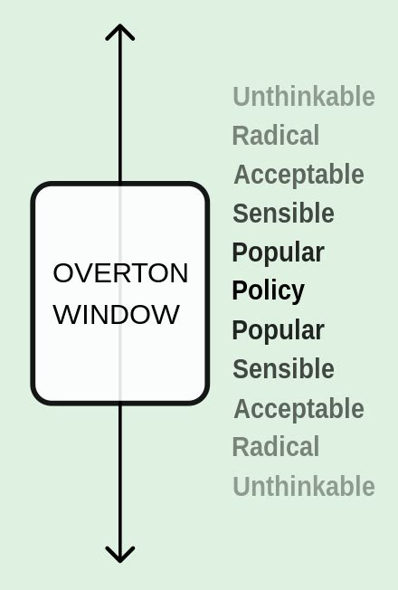
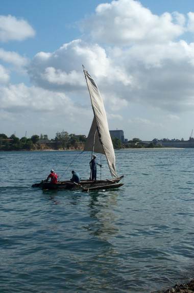
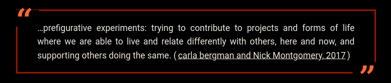

## *Panga* 

> Supporting experimental approaches to collectively meeting our basic needs of shelter, food, energy, transport, care, and connection.

<!-- 
Speaking notes....

* Building on conversations with many of you (and others in our various networks), Jade and I have been working on a project that we've been calling 'Panga'. 

* We will share more concrete details later, but for now, Panga can be described as a project to support experimental approaches to collectively meeting our basic needs. For example: 
  * One aspect of this is our goal of amplifying and developing tools to support small self-governing groups to experiment with different approaches to collectivising basic needs.
  * Another aspect is our goal of cultivating ways for people from across our various networks to connect with others interested in experimenting with collectivising one or more of their basic needs.

* It's this second aspect of our Panga goals we want to focus on today.
-->

<!-- _paginate: skip -->

---
##  Workshop Aims 

  * Clarify the values and key concepts that we hope to build upon with Panga 

  * Invite ongoing conversations and collaborations that build on this shared context  
  
  * Support people to connect with others interested in experimenting with collectivising one or more of their basic needs.

<!-- 
Speaking notes....
-->

---
## 

<!-- 
Speaking notes: see 'Background concepts'
* At the same time, there will inevitably be some concepts we're either treating as background context and/or potential tangents  
* So if we use any unfamilar terms let us know. We'll do our best to clarify background concepts on the fly and suggest some resources that provide more detail on the potential tangents.  
* For example, while the 'Overton Window' and 'Commons' are a background concepts we might reference in passing and can clarify if needed, explaining our choice of the term 'Panga' for this project could lead to tangents... 
  * Our use of the term was chosen based on it's use for the world described in the 'Monk and Robot' series of speculative fiction books written by Becky Chambers. 
  * Panga is, of course, a polysemous word - even in English it's multiple meanings include a specific type of fish, type of boat, and a type of knife....  

-->

---

## Values 
Grounded  
Interdependent 
Prefigurative
Pluralistic

## Theories of Change
Resilience through Collectivism
Think Globally, Act Locally
Prefiguring Better Futures 

<!-- 
Speaking notes....

The values we hope to embody through Panga's approach to cultivating more collective practices are: 
 
  * Grounded
  * Interdependent
  * Prefiguritive 
  * Pluralistic

The best way to describe these values is to highlight how they reflect our theories of change, so I'll go through each of these in more detail. 

For this, it may help to know that a theory of change statement typically has the structure 
'If we do this TACTIC then we can achive this STRATEGIC GOAL because of these REASONS (or, by this MECHANISM)'

In Panga, we are focusing on the tactic of 'experimenting with supporting multiple approaches to collectively meeting basic needs within our local areas'. 

We think that this tactic contributes towards three goals: 
* Resiliance through collectivism
* Thinking globally while acting locally 
* Prefiguring better futures

-->

---

# If we experiment with collectively meeting the basic needs within our local areas, we can...

build local resilience skills by providing opportunities to practice the relational skills that will help us adapt to the impacts of climage change 

##  Resilience through Collectivism

# Reflecting the values we place in... 
remaining **grounded** in our local contexts while rparticipating in **prefigurative** practices that contribute to better futures by cultivating **interdependent** relationships

<!-- 
Speaking notes....

* In the coming years and decades, local resilience will have real, on-the-ground benefits to people’s lives as we deal with the increasing effects of climate change.

* We believe that experimenting with multiple pluralistic collectives to manage basic resources can contribute to greater local resilience by providing oppourtinities to practice the relational skills that will help us adapt to climate-change driven disruptions to the current supply of basic needs (such as food, energy, and shelter) via private and/or public systems.

* Our interest in this theory of change reflects the value we place on remaining **grounded** in our local contexts, while participating in **prefigurative** practices that contribute to better futures by * cultivating resilience skills such as the web of **interdependent** trust-based relationships that have been repeatedly shown to underpin the sustainability of collective practices 

-->

---

# If we experiment with collectively meeting the basic needs within our local areas, we can...

change the Overton Window by modelling alternatives to the status quo and amplifying, and being amplified by, collective practices across the globe 

##  Think globally, act locally

# Reflecting the value we place in... 
 remaining **grounded** by our ability to impact our local conditions, while cultivating a **pluralistic** appreciation for alternative stratergies emerging within different conditions 

<!-- 
Speaking notes....
* With Panga we are concentrating on our local areas. The idea is that supporting an increase in the number of experimental ways of living more collectively in a particular area will have a noticeable impact on the Overton Window by modelling alternatives to the status quo and amplifying, and being amplified by, collective practices across the globe 
* These beliefs reflects our appreciation that the local and global are **interdependent** and our value for remaining **grounded** by our ability to impact our local conditions,  while cultivating a **pluralistic** appreciation for alternative strategies emerging within different conditions 

-->

---

# If we experiment with collectively meeting the basic needs within our local areas, we can...

explore multiple here-and-now implementions of our desired potential futures by supporting each other to explore diver approaches to collectively governing common resources

##  Prefiguring Better Futures

# Reflecting the value... 
 we place in **pluralistic** visions of what potential better futures could be, and the role of **prefigurative** experiments in our efforts to collectively reach towards ever better yet-to-be-determined futures. 

<!-- 
Speaking notes....

* In Panga we focus on experiments in various forms of *collective practices* we hope will help to 'prefigure' better futures.
* As a theory of change, the idea is that if we experiment with collectively meeting the basic needs within our local areas, we can  explore multiple here-and-now implementations of our desired potential futures by supporting each other to explore multiple approaches to collective governance of shared resources
* This idea draws on the concept of 'Prefigurative Politics' for actions that contribute to political change through ‘the deliberate experimental implementation of desired future social relations and practices in the here-and-now’. 
* While the term 'prefigurative politics' emerged from a particular sets of activist and academic contexts, I wrote an article for the Commons Library outlining how this concept has long been an important features of grassroots organising.
* This theory of change reflects our value in cultivating **pluralistic** visions of what potential better futures could be, and the value we place on the potential for **prefigurative** practices to contribute, along with other forms of activism, to us collectively reaching towards ever better yet-to-be-determined futures.
  
  

* For today, the important point is that prefigurative politics play an important role in change-making practices that can support other forms of activism - including efforts that focus on resisting and/or reforming existing systems - by planting the seeds of multiple alternatives we may want to build on in the future.

-->

---

## Collective Practices 
With *Panga* we aim to support experiments in a wide range of different collectivist practices  

We hope these experiments are prefigure better futures by opening up space for a wide range of better possibilities towards which we might direct our collective futures 

<!-- 
Speaking notes....

* collective practices as a form of prefigurative politics 

-->

---

---

### Pluralistic Approaches 
* pluralistic approaches to collective practices 

<!-- 
Speaking notes....
-->
---

### Basic needs Grounded in Place
* content 

<!-- 
Speaking notes....
-->
---

### Capacity for change
* content 

<!-- 
Speaking notes....
-->
---

### Overlapping Pluralist Collectivism
* content 

<!-- 
Speaking notes....
-->

---

### Panga  
* content 

<!-- 
Speaking notes....
-->

---

### The Panga Campfire 
* content 
<!-- 
Speaking notes....
-->

---

### Participatory practices
* content 

<!-- 
Speaking notes....
-->

---
### Invitation principles
* content 

<!-- 
Speaking notes....
-->

---
## Further Resources

* More info about [Panga](https://panga.network/orientation) and the [Panga Campfire](https://panga.network/campfire/)

* Exercise to help identify one or more [Theory of Change](https://commonslibrary.org/wheres-the-power-developing-your-theory-of-change-template/) relevant to a particular set of contexts and aims.

* [Commoning](https://commonslibrary.org/practising-commoning/) concept summary 

* [Prefigurative Politics](https://commonslibrary.org/prefigurative-politics-in-practice/) concept summary

<!-- 
Speaking notes....
-->

